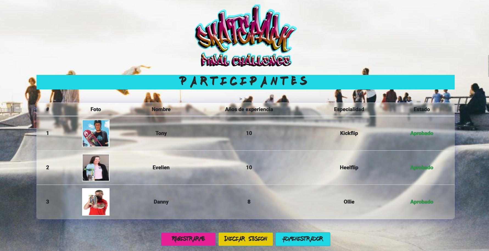
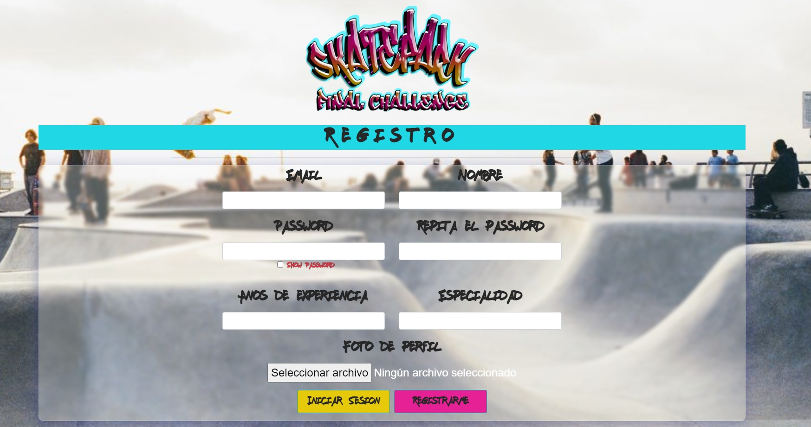
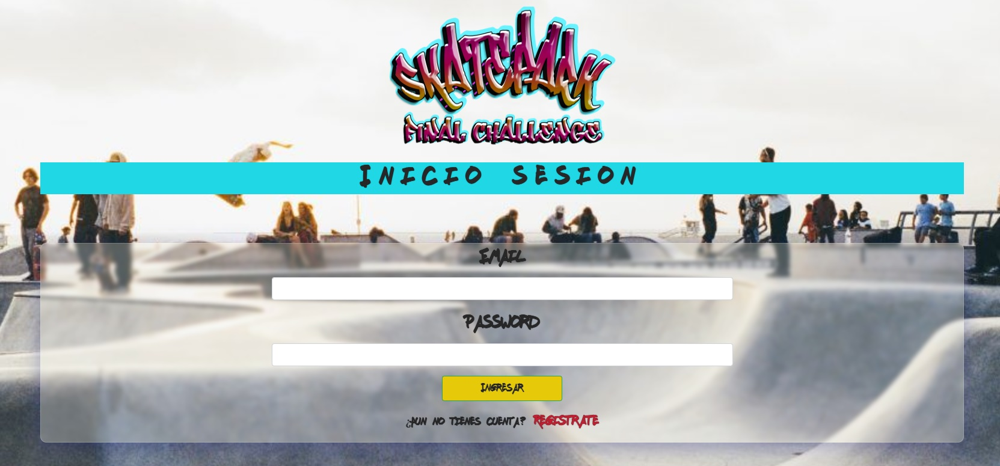
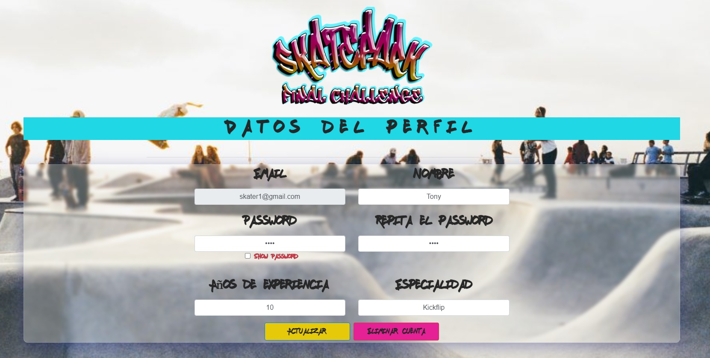
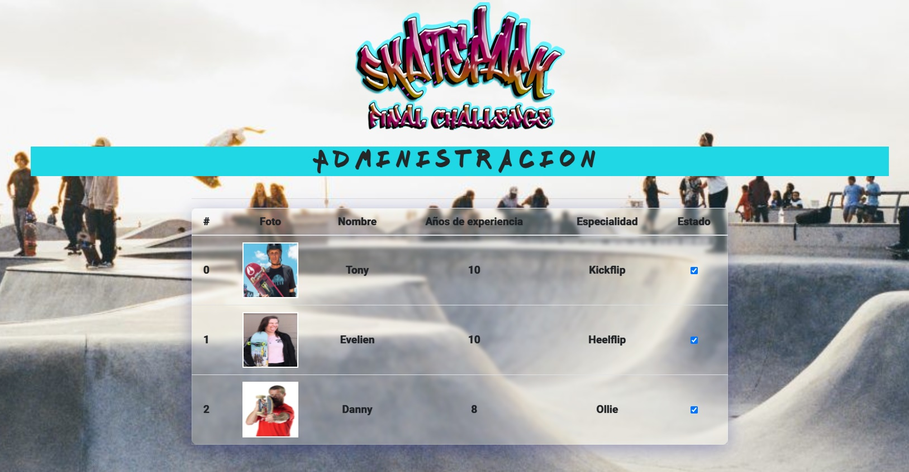

    

# Prueba - Skate Park

En esta prueba deberás ocupar todos tus conocimientos para desarrollar un sistema que
involucre tus habilidades como Full Stack Developer, consolidando tus competencias en el
frontend y backend.

## Comenzando 🚀

_Estas instrucciones te permitirán obtener una copia del proyecto en funcionamiento en tu máquina local para propósitos de desarrollo y pruebas._

- $ git clone https://github.com/krakerbrain/prueba_skate_park
- $ cd ../path/to/the/file
- $ npm install
- $ node server.js

### Indicaciones:

- El sistema debe permitir registrar nuevos participantes.(http://localhost:3000/registro)

- Se debe crear una vista para que los participantes puedan iniciar sesión con su
  correo y contraseña.(http://localhost:3000/login)

- Luego de iniciar la sesión, los participantes deberán poder modificar sus datos,
  exceptuando el correo electrónico y su foto. Esta vista debe estar protegida con JWT
  y los datos que se utilicen en la plantilla deben ser extraídos del token.(http://localhost:3000/datos)

- La vista correspondiente a la ruta raíz debe mostrar todos los participantes
  registrados y su estado de revisión.(http://localhost:3000/)

- La vista del administrador debe mostrar los participantes registrados y permitir
  aprobarlos para cambiar su estado.(http://localhost:3000/admin)

### Requerimientos

1. Crear una API REST con el Framework Express
2. Servir contenido dinámico con express-handlebars
3. Ofrecer la funcionalidad Upload File con express-fileupload
4. Implementar seguridad y restricción de recursos o contenido con JWT

### Implementaciones adicionales

- En la vista correspondiente a la ruta raíz se implementa botón para ingresar a la vista de administrador
- Se hacen validaciones de password para no repetirlos en el formulario
- Se hace validación de correo para evitar que se ingrese un correo repetido
- La lógica del front se separa del HTML y se implementa en un módulo aparte (archivo /public/index.js)
- La lógica del backend se separó en diferentes módulos: 
                     - Las consultas a la base datos (/database/consultas.js) 
                     - Las funciones que resuelven las consultas (/controllers/controladores.js)
                     - Las rutas (/routes/usuarios.js)
                     - Las configuraciones y módulos requeridos(/server.js)
                     - Las funciones de autenticación y verificación del token(/controllers/tokenVerify.js)
- Se implementa módulo Singleton para usar solo una instancia de pool(/database/pooldb.js)

### Despliegue

El usuario ingresa a la ruta raíz (http://localhost:3000/) en donde debe elegir si registrarse o loguearse. 
En esta misma vista puede entrar el administrador de la página.

El administrador ingresa a (http://localhost:3000/admin) y en esta vista puede aprobar o desaprobar la participación de 
un usuario

Si el usuario decide registrarse ingresa a (http://localhost:3000/registro) en donde deberá llenar sus datos teniendo
cuidado de no dejar campos vacíos y no repetir la contraseña. Si el usuario ingresa un correo ya registrado, se despliega
un alert que indica que el correo ya ha sido registrado y la la ruta /registro se recarga para ser llenada nuevamente

Al terminar el registro o al apretar el botón INICIAR SESIÓN desde la ruta raíz, el usuario ingresa a (http://localhost:3000/login)
donde deberá ingresar los datos correctos para registrarse. Si se aprueba el ingreso el usuario entra a (http://localhost:3000/datos)
donde podrá modificar todos los datos excepto el correo y la foto, y luego podrá actualizar su registro. Caso contrario,
el usuario no pasa la verificación o no tiene la aprobación del administrador, se despliega un alert que indica la negativa.

En la ruta de modificación de datos el usuario podría querer eliminar su registro. Al presionar el botón de eliminar, se despliega
un alert de confirmación de querer eliminar su registro. Luego de confirmar se despliega la ruta raíz donde podrá comprobar
que su registro ha sido eliminado

##### Las siguientes imágenes representan las interacciones que debe tener el sitio web una vez terminado el desafío.

###### Así debería verse la vista de la ruta raiz

###### Registro de Participantes

###### Login de participantes

###### Vista de modificación de datos

###### Vista de administrador

## Construido con 🛠️

- Javascript
- HTML
- CSS
- nodeJS(https://nodejs.org/en/)

#### Usando las librerías:

- [Express](https://expressjs.com/es/)
- [Express File Upload](https://www.npmjs.com/package/express-fileupload)
- [JsonWebToken](https://www.npmjs.com/package/jsonwebtoken)
- [node-postgres](https://www.https://www.npmjs.com/package/pg)
- [node.bcrypt.js](https://www.npmjs.com/package/bcrypt)
- [Handlebars](https://handlebarsjs.com/)
- [Bootstrap](https://getbootstrap.com/)

## Autor ✒️

- **Mario Montenegro**
